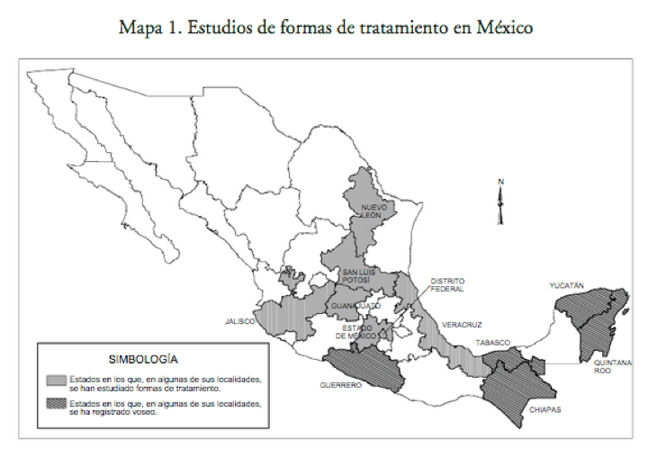

```{r setup, include=FALSE}
library(tidyverse)
library(kableExtra)
options(htmltools.dir.version = FALSE)
# Load pilot data from study:
dData <- read.csv("dData.csv")
participantes <- read.csv("participantes.csv")
```

```{r, load_refs, echo=FALSE, cache=FALSE}
library(RefManageR)
BibOptions(check.entries = FALSE, 
           bib.style = "authoryear", 
           cite.style = 'authoryear', 
           style = "markdown",
           hyperlink = FALSE, 
           dashed = FALSE)
myBib <- ReadBib("/Users/maxcarey/Documents/tesis/Zotero.bib", check = FALSE)
```


```{r xaringan-themer, include = FALSE}
library(xaringanthemer)
duo_accent(primary_color = "#002B7A", secondary_color = "#D59F0F")
```

class: title-slide

# Migration, Dialect Contact, and Language Change

## The Case of *Chihuahuenses* in Mexico City

<center>
April 1st, 2019
</center>

<br>
.pull-right[
### Max Carey
### Advisers: Dr. Érika Mendoza, Dr. Pedro Martín Butragueño
]

<br>

<div class="iconFront"> </div>

---
class: inverse, center, middle

# Introduction

---

layout: true


<div class="my-footer"></div>
---

# Introduction


- Dialect contact? `r Citep(myBib, 'trudgill_dialects_1986')`

???

- 30 seconds intro intro, what I'm doing where I study

- One minute intro to my thesis topic.

- 

--

  - What is a dialect/sociolect/ethnolect? (**language variety**)


--
  
  - What do I mean by contact?

--

- What am I studying, specifically?

--

  - *Chihuahuenses* en la Ciudad de México

--

- Why does it matter?

--

  - Linguistically
  
--

  - Socially
  
--

- Background

---

layout: false

class: inverse, center, middle

# Background

---

layout: true


<div class="my-footer"></div>

---

# Background

- The different dialects of Mexican Spanish (just like any other language) vary at each structural level.

--

- Pragmatics

--

> In Mexico City, it's considered polite to say **"buen provecho"** when passing by other patrons at a bar, which is not the case in Chihuauhua.
<audio controls>
  <source src="buenProvecho.wav" type="audio/wav">
Your browser does not support the audio element.
</audio> <sup><sup>chi-en-cdmx-m-23</sup></sup>


---

layout: true

<div class="my-footer"></div>

---

# Background

- Syntax

--

> In CDMX, verbs are conjugated according to *tú* and *usted*, in certain states, "vos" is used (by some people). **¿Qué decís?** vs. **¿Que dices?** `r Citep(myBib, 'orozco_formas_2010')`


---

layout: true

<div class="my-footer"></div>

---



Map reproduced from `r Citep(myBib, 'orozco_formas_2010')`

<div class="my-footer"></div>


---

layout: true

<div class="my-footer"></div>

---
# Phonological charactersitsics of varieties of Mexican Spanish (Examples)

- Circumflex intonation `r Citep(myBib, 'martin_butragueno_configuraciones_2004')`

--

> A rising and falling intonational pattern, typical of Mexico City. (men and lower socioeconomic groups)
<audio controls>
  <source src="cdmx-in-situ-8-circunfleja-1.wav" type="audio/wav"> </audio> <sup><sup>cdmx-in-situ-m-31</sup></sup>

> "**Complicado**" (Complicated)

--

> <audio controls>
  <source src="cdmx-in-situ-8-circunfleja-2.wav" type="audio/wav"> </audio> <sup><sup>cdmx-in-situ-m-31</sup></sup>


> "Y eso era lo malo porque, pues, los **medicaban**, era, pues, practicamente, por toda su **vida**"

---

# Phonological charactersitsics of varieties of Mexican Spanish (Examples)

- Devoiced vowels `r Citep(myBib, 'serranomorales2006')`

>  Lack of vocal fold vibration, shorter duration, lower volume

--

> <audio controls>
  <source src="debilitaUno.wav" type="audio/wav"></audio>
<sup><sup>cdmx-in-situ-f-27s</sup></sup>

> "Era un solo **maestro**"

> "It was just one teacher"

--

> <audio controls><source src="debilitaDos.wav" type="audio/wav"> </audio><sup><sup>cdmx-in-situ-f-27s</sup></sup>

> "Eso es lo que no me **encanta**"

> "That's what I don't really like"

---

# Phonological charactersitsics of varieties of Mexican Spanish (Examples)

> Use of "sh" for "ch" ([ʃ] for /tʃ/) `r Citep(myBib, 'gil2014')`

--

> <audio controls><source src="ch.wav" type="audio/wav">

> Las personas mayores que decían, "No, para irse a **Chihuahua** era **echarse** **lonche**"

> Older people would say, "No way, to go to Chihuahua you gotta pack a lunch"

---

# Phonological charactersitsics of varieties of Mexican Spanish (Examples)

- Weakening of intervocalic /d/ `r Citep(myBib, 'serrano_2008')`
> <audio controls><source src="dUno.wav" type="audio/wav"> </audio>

> Es un destilado

---

layout: false

class: inverse, center, middle

# My specific research

---

layout: true


<div class="my-footer"></div>

---

# My specific research questions

> 1a) Does the speech of migrant *chihuahuenses* who move to Mexico City (a new dialect zone) change? If so, how? 

--

> 1b) Does this population produce "stronger" variants of intervocalic /d/?

--

> 1c) If so: What are the social, linguistic and identity factors that contribute to accomodation?

---

# Corpus

#### Table 2: Participants in my thesis study
```{r mostrar_tabla_hablantes, echo=FALSE}
participantes %>%
  arrange(uniqueID) %>%
  kable() %>%
  kable_styling() %>%
  scroll_box(width = "100%", height = "380px")
```

---
# Results of pilot study

#### Figura X: Ploteos de densidad de la variable dependiente por grupo dialectal
```{r, echo=FALSE, fig.height=6, fig.width=12}
ggplot(dData, aes(x = intensityDif, fill = grupo)) +
  geom_density(alpha = .3) + theme(legend.text=element_text(size=40), legend.key.size = unit(2, "cm"))
```


---

# References (1/2)

```{r, 'refs2', results='asis', echo=FALSE}
PrintBibliography(myBib, start = 1, end = 4)
```

---

# References (2/2)

```{r, 'refs3', results='asis', echo=FALSE}
PrintBibliography(myBib, start = 5, end = 7)
```