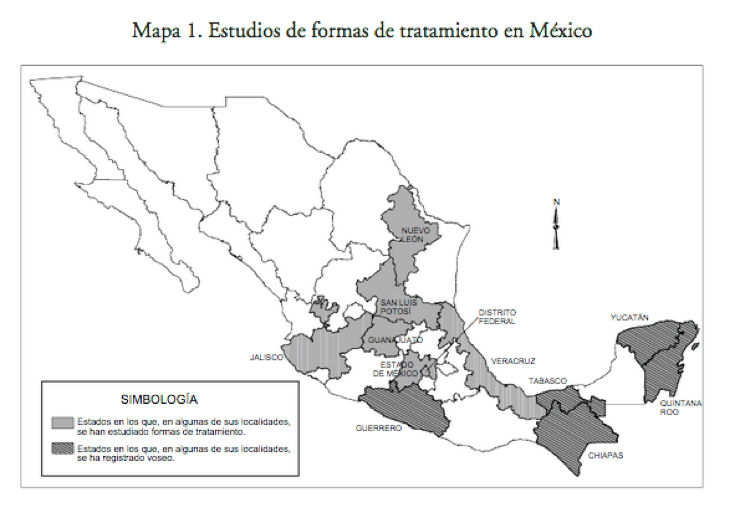

```{r setup, include=FALSE}
options(htmltools.dir.version = FALSE)
```

```{r xaringan-themer, include = FALSE}
library(xaringanthemer)
duo_accent(primary_color = "#002B7A", secondary_color = "#D59F0F")
```

class: title-slide

# Migration, Dialect Contact, and Language Change

## The Case of *Chihuahuenses* in Mexico City

<center>
April 1st, 2019
</center>

<br>
.pull-right[
### Max Carey
### Advisers: Dr. Érika Mendoza, Dr. Pedro Martín Butragueño
]

<br>

<div class="iconFront"> </div>

---
class: inverse, center, middle

# Introduction

---

layout: true


<div class="my-footer"></div>
---

# Introduction

- Dialect contact?

--

  - What is a dialect/sociolect/ethnolect? (**language variety**)
  
--
  
  - What do I mean by contact?

--

- What am I studying, specifically?

--

  - *Chihuahuenses* en la Ciudad de México

--

- Why does it matter?

--

  - Linguistically
  
--

  - Socially
  
--

- Background


???

- Give a one minute introduction to myself, what I'm doing for my Fulbright program.
- Give a one mintue introduction to my thesis project.

---

layout: false

class: inverse, center, middle

# Background

---

layout: true


<div class="my-footer"></div>

---

# Background

- The different dialects of Mexican Spanish (just like any other language) vary at each structural level.

--

- Pragmatics

--

> In Mexico City, it's considered polite to say **"buen provecho"** when passing by other patrons at a bar, which is not the case in Chihuauhua.
<audio controls>
  <source src="buenProvecho.wav" type="audio/wav">
Your browser does not support the audio element.
</audio>

---

layout: true

<div class="my-footer"></div>

---

# Background

- Syntax

--

> In CDMX, verbs are conjugated according to *tú* and *usted*, in certain states, "vos" is used (by some people). **¿Qué decís?** vs. **¿Que dices?** (Orozco, 2010: 256)

---


Map reporoduced from Orozco (2010: 256)

<div class="my-footer"></div>

---
Technical Notes

---
